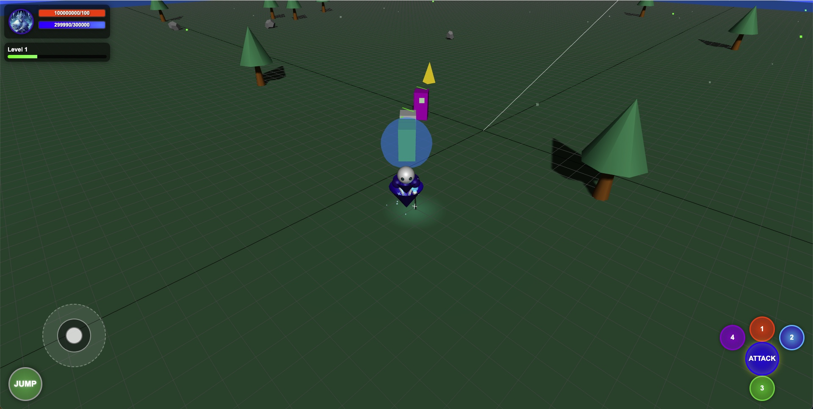
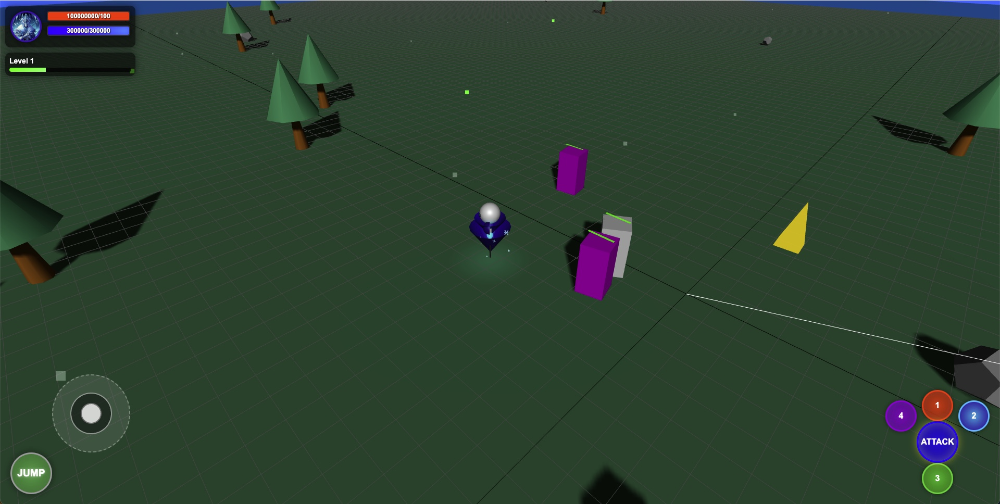

# Legends of the Ancient Realms

An isometric action RPG built with Three.js that combines the quest-driven, dungeon-crawling gameplay of classic ARPGs with a diverse hero roster.

## Getting Started

### Prerequisites

- A modern web browser (Chrome, Firefox, Safari, Edge)
- Local web server (optional, for development)

### Running the Game

1. Clone this repository
2. Open `index.html` in your web browser
   - For the best experience, use a local web server to serve the files

### Controls

- **Mouse Controls**:
  - Left-click: Move hero / Select target
  - Right-click: Use targeted ability
  - Middle-click + drag: Rotate camera
  - Mouse wheel: Zoom in/out

- **Keyboard Controls**:
  - WASD: Move hero
  - Q/W/E/R: Use abilities
  - Space: Dodge/Evade (not implemented yet)

## Features

### Phase 1: Core Mechanics (Implemented)

- Character movement and camera controls
- Basic combat system
- Hero selection (Axe, Crystal Maiden, Lich, Storm Spirit)
- Simple test environment

### Phase 2: Expanded Features (Planned)

- Skill systems and progression
- Basic inventory and item system
- First dungeon area

### Phase 3: Content Development (Planned)

- Complete story implementation
- Multiple environments and dungeons
- Full roster of enemies and bosses
- Quest system

### Phase 4: Polish and Release (Planned)

- UI refinement
- Performance optimization
- Audio implementation
- Beta testing and release

## Development

The game is built using:

- Three.js for 3D rendering
- Vanilla JavaScript for game logic
- HTML/CSS for UI

## License

This project is licensed under the MIT License - see the LICENSE file for details.

## Acknowledgments

- Inspired by Diablo II, DotA/Warcraft III, and Path of Exile
- Based on requirements specified in `docs/requirement.md`